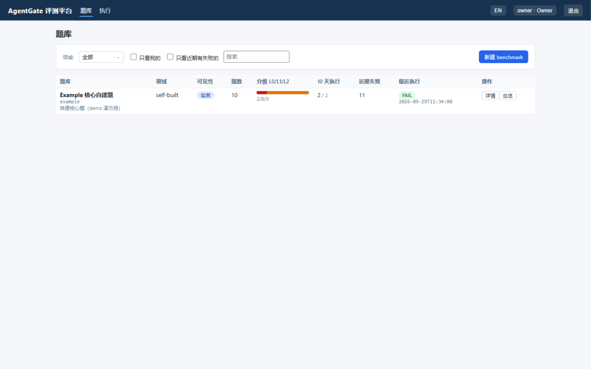

<div align="right">English（this page） | [简体中文](README.md)</div>

# AgentGate · Enterprise Agent Evaluation Platform

AgentGate is a web-based evaluation platform for enterprise agents: organize the questions
you care about into **case banks**, launch **evaluation runs** against the agent under test,
and get automatic **verdicts, trajectory analysis, six-dimension scores and diagnostic
reports** as the evidence for release decisions.



## What it does

| Capability | Description |
|---|---|
| Case banks | Online authoring (numeric/boolean/extractive/free_text/refusal/state), Excel batch, open-benchmark adaptation |
| Runs | Multi-bank combos, level filters, message-level recording (on by default), optional stability check (pass^k) |
| Judging | Three layers: hard checks (red lines/format/final answer) -> AI judge suggestions -> human review; **checkpoint partial credit** for numeric cases |
| Six-dimension score | Success / Quality / Reliability / Stability / Efficiency / Cost / Safety — radar + per-dimension diagnostic cards |
| Trajectory & diagnostics | OTLP spans + message-level recording; skip-answer / loops / broken chains / denied attempts / injection leaks all feed the diagnostics |
| AI assist (optional) | Report summary, failure root causes, judge suggestions, case & domain-pack drafting |
| Roles | owner / admin / member / viewer; per-user "my way of running" on public banks |


## Quick start

Prerequisite: a Linux server with Docker. Clone both repos side by side:

```bash
git clone https://github.com/<org>/agent-contracts.git
git clone https://github.com/<org>/agentgate.git
cd agentgate
OWNER_PASSWORD='secret' docker compose up -d --build     # platform (frontend built in-image)
docker compose --profile agent up -d --build             # optional: sample agent
```

Open `http://SERVER_IP:8030` -> sign in as owner -> launch a run against
`http://jiuwen-agent:8200` -> read the radar. The full **create-bank -> run -> report**
walkthrough with screenshots is in the [Demo](docs/en/demo.md); environment details and
offline deployment in [Deployment](docs/en/deployment.md).


## Documentation

| Doc | Contents |
|---|---|
| [Demo](docs/en/demo.md) | Full walkthrough: create a bank -> run -> report (screenshots) |
| [Deployment](docs/en/deployment.md) | From-zero environment, two deploy modes, ports, offline, FAQ |
| [Architecture & layout](docs/en/architecture.md) | Design principles + sub-doc index + repo layout |
| ├ [Trace recording](docs/en/trace-recording.md) | OTLP spans + recording proxy — why two channels |
| ├ [Scoring](docs/en/scoring.md) | Three-layer judging, gold v2, six-dimension rules |
| ├ [Sandbox execution](docs/en/sandbox.md) | Where the agent runs, isolation boundary, roadmap |
| ├ [AI assist](docs/en/ai-assist.md) | Platform-side LLM features, credentials, boundaries |
| └ [Diagnostic report](docs/en/diagnostic-report.md) | Report structure, diagnostic cards, artifacts |
| [Runs & archiving](docs/en/run-eval.md) | Launch, queue, pending review, archive/cleanup rules |
| [Create a bank](docs/en/bank-create.md) | Private/public wizard, open-benchmark adaptation, AI drafting |
| [Edit a bank](docs/en/bank-edit.md) | Every authoring field explained with examples |
| [Agent integration](docs/en/agent-integration.md) | /invoke contract, trace export, recording, capability handshake |
| [Open-source banks](docs/en/public-banks.md) | FinanceBench / LoCoMo / LongMemEval / τ-bench download & regeneration |
| [Permissions](docs/en/permissions.md) | Four roles, per-user overrides on public banks |
| [Testing guide](docs/en/developing.md) | Developer view: unit / offline smoke / web tests / fixtures |

## Honest boundaries

- **Layered honesty**: cases the machine cannot judge are marked PENDING (judge suggestion /
  human); missing data shows n/a — no fake scores.
- Open-benchmark results are for **observation only**, never a release-accept criterion
  (contamination guard).
- The platform observes and judges; accept/rollback decisions belong to the evolution
  control plane (roadmap).
