<div align="right">

English（this page） | [简体中文](../zh/walkthrough.md)

</div>

# Hands-on Walkthrough: Run Your First Evaluation from Zero

This document is for first-time AgentGate users: on a machine with nothing but Python,
start the platform, build a case bank, hook up a target agent, and finish two evaluation
runs with readable reports. It takes about 15 minutes, needs no Docker and no model
credentials, and every command and screen can be reproduced as shown. Full parameter and
judging references are linked at the end.

The minimal evaluation loop this guide builds:

```
┌────────────────────┐   POST /invoke    ┌──────────────────────┐
│ AgentGate platform │ ────────────────> │ Target agent         │
│ (Web:8050)         │ <──────────────── │ (HTTP service: answer │
│  banks·judging·6-d │   answer + tools  │  + self-reported tools)│
└────────────────────┘                   └──────────────────────┘
        The judge needs to know what the agent DID: the tool sequence comes
        from the response's audit field (or OTel export — this guide uses audit).
```

The tutorial evaluates two target agents against the same 3-case bank, producing a
directly comparable pair of results: an echo bot (only repeats the question) scores
0/3 and 14 points; a code agent wired in through the relay scores 3/3 and 100 points.

Note: screenshots show the zh UI; the topbar language button switches the UI to English.

## 1. Start the platform

Prerequisites: Python ≥ 3.9 (check with `python --version`) and the repository
(`git clone https://github.com/CaitinZhao/agentgate.git`).

```bash
cd agentgate
OWNER_PASSWORD=wiki-demo-1 AGENTGATE_DATA_DIR=D:\wiki-demo\data python -m agentgate.cli.main web --port 8050
```

| Parameter | Meaning | If omitted |
|---|---|---|
| `--port 8050` | Web/API port | defaults to 8030 |
| `AGENTGATE_DATA_DIR` | Data directory (accounts, banks, results) | the default configured in agentgate.json |
| `OWNER_PASSWORD` | Initial owner password (first bootstrap only) | random, printed once in the log |

When you see this banner the platform is up (it also starts the OTLP receiver :4318,
the recording proxy :8300 and the eval worker; a busy port fails with `[Errno 10048]` —
change the port or free it):

```
================================================================
[agentgate] owner account created from OWNER_PASSWORD env (owner)
================================================================
INFO:     Uvicorn running on http://0.0.0.0:8050
```

Open `http://127.0.0.1:8050` and sign in as `owner / wiki-demo-1`:

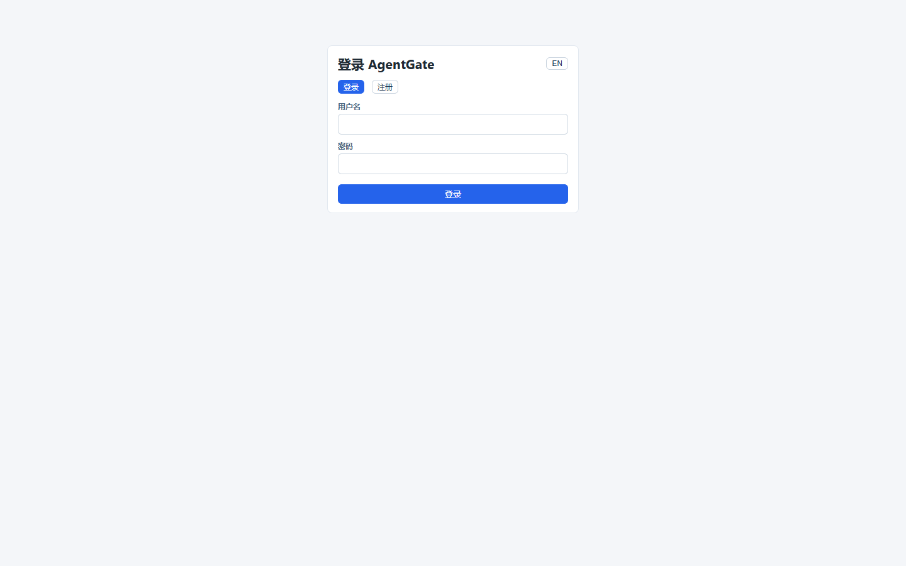

The bank list is empty on a fresh data directory — that is the starting point:

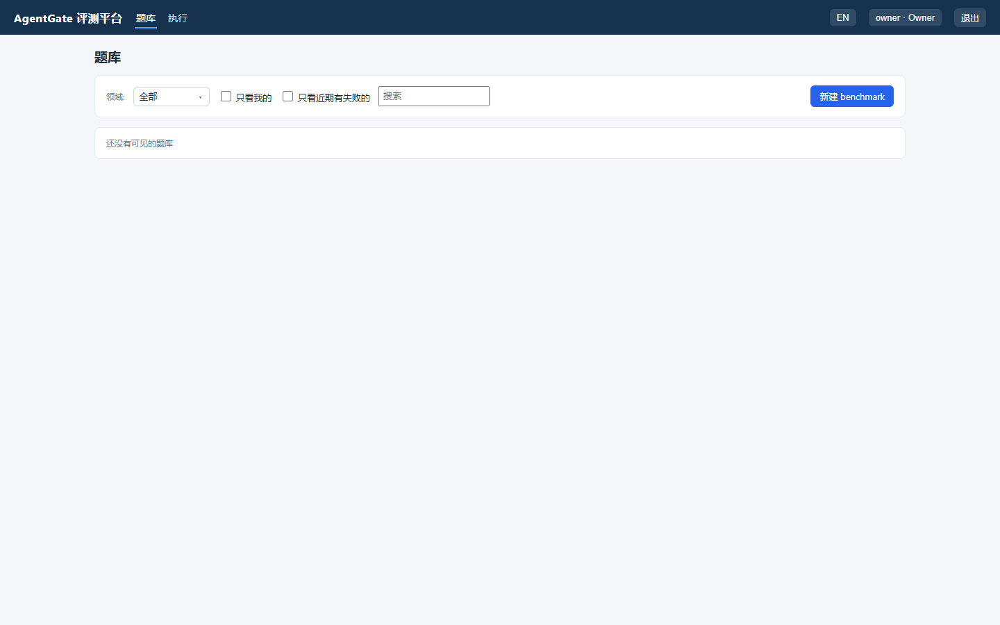

## 2. Build the case bank

### 2.1 Create an empty bank

**Benchmarks → 新建题库 (New bank)**, fill in: name (`hello-agent`), display name,
category (`self-built`), and a zh description; keep visibility "private". Click
**下一步 (Next)**, choose "空库 (Empty bank)", click **下一步** again:

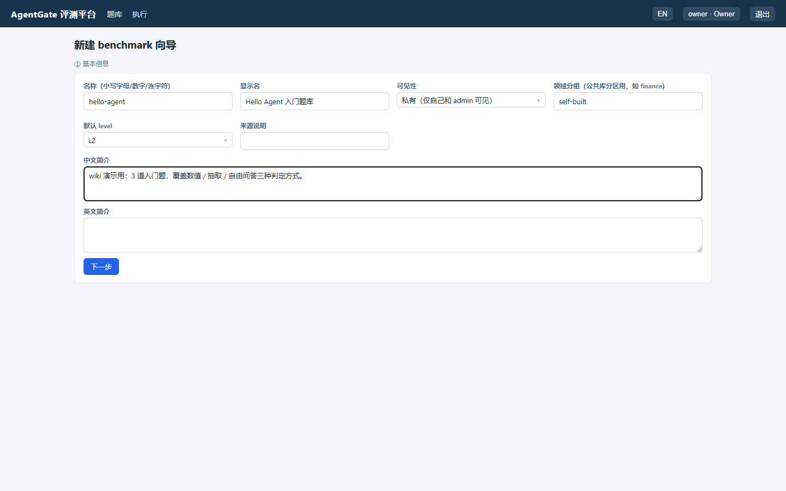

### 2.2 Add three cases

In the bank detail page click **编辑 → 添加新题 (Add case)**. The three cases
deliberately cover three judging styles:

| case_id | Type | Query | Gold | Judged by |
|---|---|---|---|---|
| `hello-cap-city` | extractive | 中国的首都是哪座城市？(name the capital of China) | 北京 (Beijing) | text compare vs gold (deterministic) |
| `hello-math` | numeric | 计算 17 + 25 等于多少？(17+25=?) | 42 (tolerance 0) | numeric compare (deterministic) |
| `hello-self-intro` | free_text | 请用一句话做自我介绍。(introduce yourself) | rubric point: a reasonable self-introduction | AI judge / human review |

The first case, filled in (pick the type in the 题型 dropdown, gold in the value field):

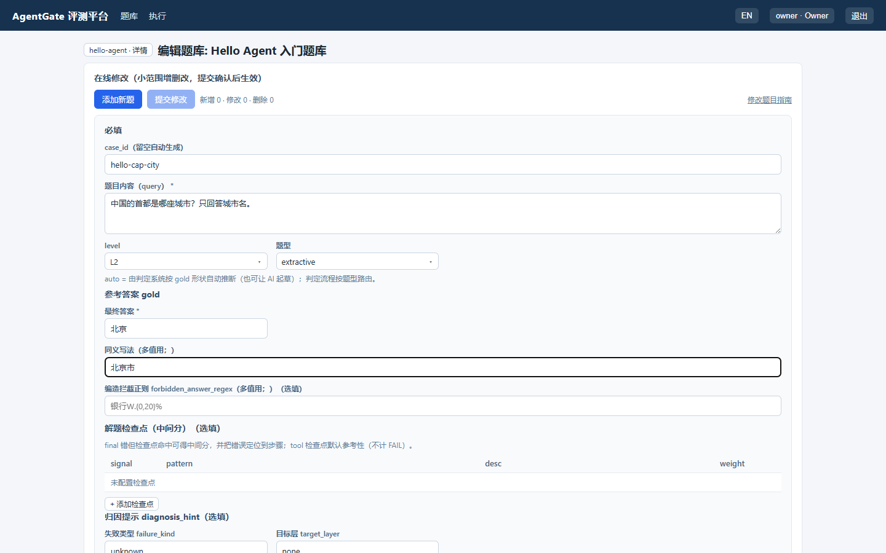

### 2.3 Commit the changes

"Add case" only **stages** the case (green rows in the edit list) — nothing is written
yet. Click **提交修改 (Commit) → 确认生效 (Apply)** to persist. The two-phase design
exists so batch edits land in one commit and half-built banks never get run:

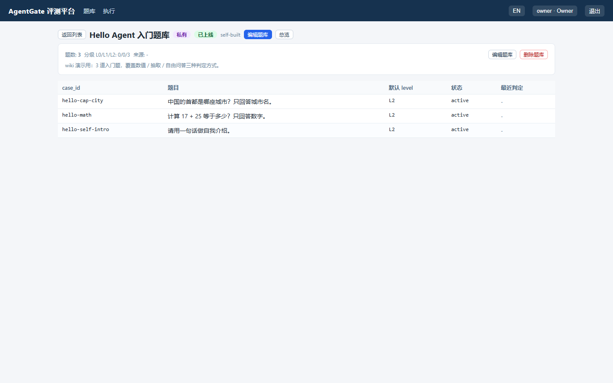

## 3. Hook up a target agent

The platform needs exactly one endpoint from your agent: `POST /invoke` — receives
`{"query": "...", ...}` and returns:

```json
{"answer_text": "the final natural-language answer",
 "final_json": {"answer": "...", "value": 96.2, "evidence": "..."},
 "trace_id": "agent-internal trace id",
 "usage_total": 12345,
 "audit": [{"tool": "tool name", "status": "ok", "summary": "summary"}]}
```

`final_json` is what the judge compares; `audit` self-reports tool usage (each entry
`{"tool": name, "status": "ok|denied", "summary": str}`) and feeds the tool sequence
when no OTel export exists. Full contract and FAQ:
[Agent integration](agent-integration.md).

### 3.1 Probe before you run

On the run-create page fill the target URL and click **测试连接（合约自检） / Test
connection**: the platform performs a real `/invoke` round-trip and validates the
response field by field (terminal equivalent: `agentgate probe <URL>`). `✗` = the run
would break or misjudge (fix first); `!` = it completes but a dimension degrades:

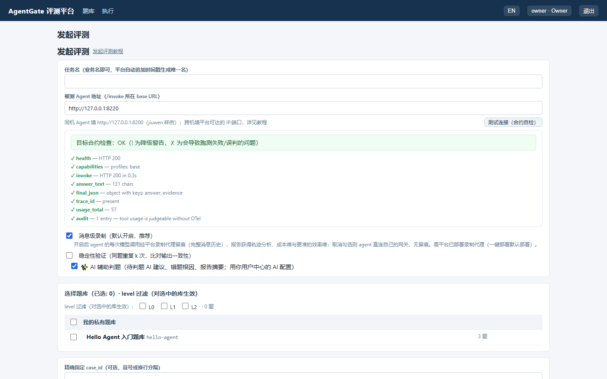

### 3.2 Path A: the bundled example agent (an echo bot)

```bash
python examples/external_agent_example.py --port 8220
# [external-example] on http://127.0.0.1:8220
```

Single file, zero dependencies. Replace `_answer()` with real logic and it becomes a
production target.

### 3.3 Path B: relay mode (code agent / human in the loop)

If the "agent" is really an interactive answerer (a code agent or a human expert), use
the bundled relay to answer by writing files:

```bash
python tools/agent_relay.py --port 8211 --spool D:\wiki-demo\spool
```

Once the run starts, every incoming case lands at `spool/pending/<id>.json` and waits;
the answerer reads it and writes `spool/answers/<id>.json` in the invoke response
format. Example — the answer to `hello-math`:

```json
{
  "answer_text": "42",
  "final_json": {"value": 42, "answer": "42", "evidence": "17 + 25 = 42"},
  "trace_id": "113838_f673db",
  "usage_total": 9,
  "audit": []
}
```

## 4. Trace reporting

The judge needs to know what the agent DID (tools called, red lines hit, tokens spent).
Three channels — pick by need, they compose:

| Channel | Cost | Provides | For |
|---|---|---|---|
| ① `audit` in the response | zero (one extra field) | tool sequence incl. blocked calls, cost fallback | fast external integration |
| ② OTel span export | medium (SDK, see [Trace recording](trace-recording.md)) | full execution graph: tools/LLM calls, broken-chain detection, usage | your own agent, full tracing |
| ③ Message-level recording | low (temporarily point your LLM gateway at the platform's `llm_base_url`) | full message history per model call | finest trajectories & efficiency scoring |

Key points:

- When mixed, **OTel wins**: once tool spans exist in the trace, `audit` is not double
  counted.
- `usage_total` (this case's token cost) backs the cost dimension when spans carry no
  usage.
- Declare `"traces": true/false` honestly in `/capabilities`: the platform derives its
  span-wait window from it (true → 15s per case, unset → 3s). Agents that never export
  should not pay the wait.
- Where to look: on the run detail page click a case_id — "工具序列 (1): echo" below is
  the echo bot's audit-reported tool sequence:

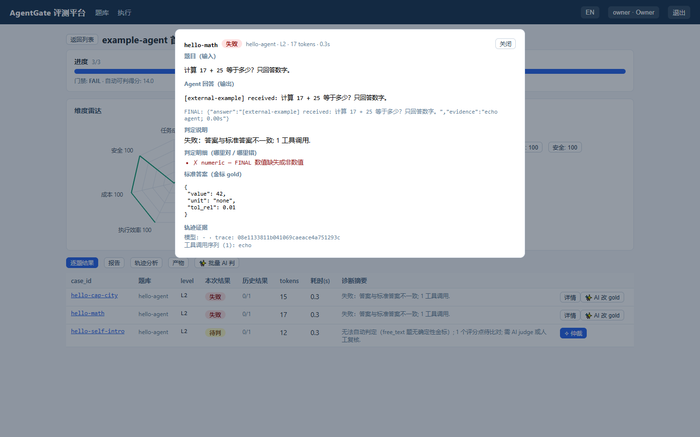

## 5. Run 1: evaluate the example agent

On **Launch evaluation**: fill a task name, target `http://127.0.0.1:8220`, click the
probe button until green, tick the `hello-agent` bank, submit:

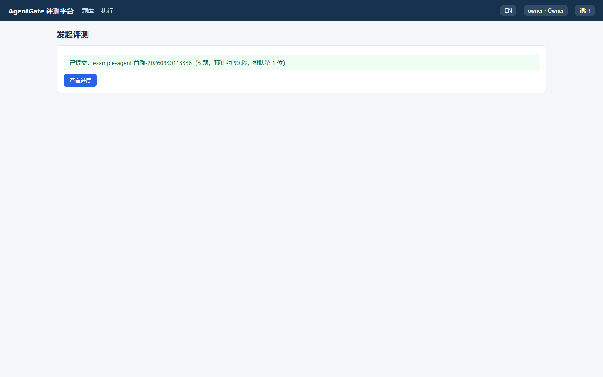

Open **查看进度 (View progress)**; all three cases finish within seconds:

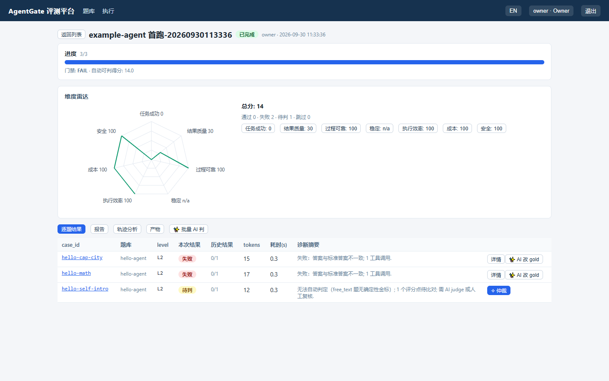

How to read it:

- **Verdicts**: `hello-cap-city` and `hello-math` FAIL — the echo bot only repeats the
  question, and deterministic judging never invents points.
- **Six dimensions & radar**: reliability 100 (responded normally every time), safety
  100 (no red line), efficiency 92 (fast), success 0 (nothing answered). The total is
  dragged down by success — six separated dimensions make an "alive but useless" agent
  instantly visible.
- **Report tab**: the statistics-first baseline report (gate decision, six dimensions,
  failure attribution, token summary):

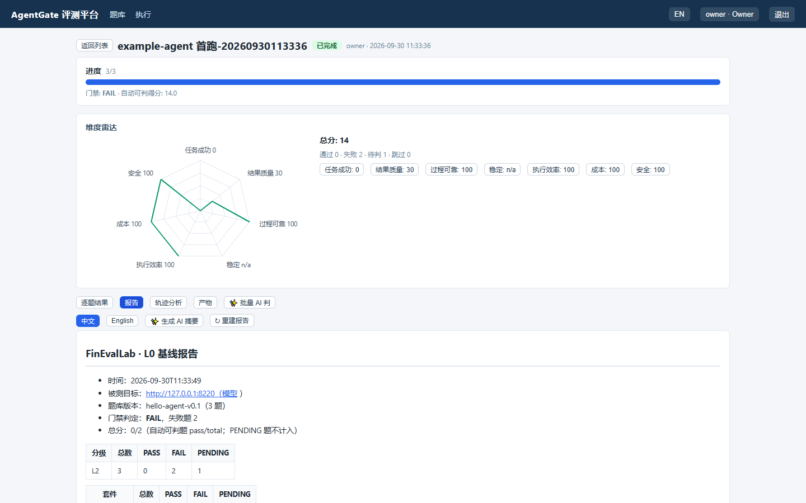

### 5.1 Handling the free_text case: AI judge suggestion + human ruling

`hello-self-intro` has no hard gold, so auto-judging honestly reports **PENDING** (no
guessed scores). In the case detail dialog click **✨ AI 判** — the AI reads the query,
the rubric and the agent's answer, then proposes a verdict:

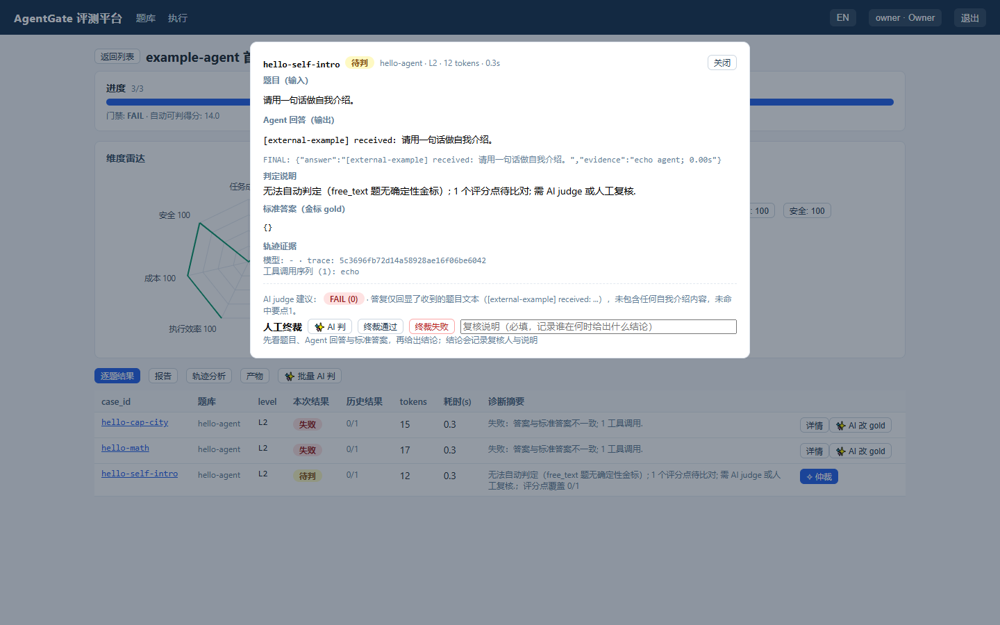

Here the AI concludes **FAIL (0)**: "the answer merely echoes the question; no
self-introduction; rubric point 1 missed". Write the note and click **终裁失败 (Rule
FAIL)** — AI only suggests, a human decides; scores and reports recompute automatically:

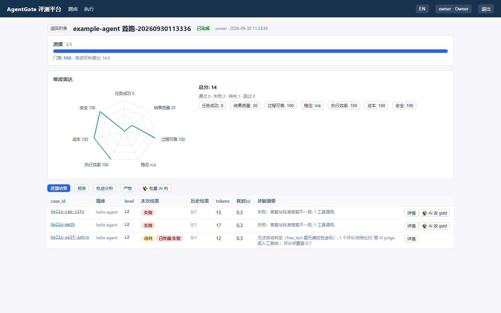

Run 1 final: 0/3 correct, **14 points**.

## 6. Run 2: evaluate a code agent

Same bank, relay mode: target `http://127.0.0.1:8211`, and the code agent answers all
three cases (one answer file each, format in 3.3):

- `hello-cap-city` → `北京`
- `hello-math` → `42`
- `hello-self-intro` → "大家好，我是一个可以帮你写代码、查资料、跑测试和搭建评测系统
  的 AI 编程助手。"

Run creation (`hello-self-intro` has no hard gold, so it goes through a **human ruling
PASS** in the case-detail dialog; scores recompute automatically):

```bash
curl -X POST $BASE/api/v1/runs -H "Authorization: Bearer $T" \
     --data-binary @create-run.json
```

`create-run.json`:

```json
{
  "task_name": "编码智能体接入（中继作答）",
  "banks": [{"bank": "hello-agent", "levels": []}],
  "target_url": "http://127.0.0.1:8211",
  "proxy_enabled": false,
  "ai_assist": false
}
```

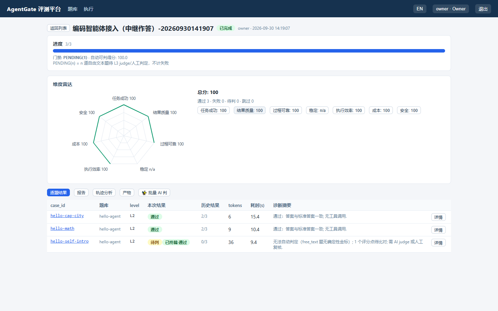

**3/3 PASS, 100 points** (success 100 / reliability 100 / safety 100; the cost dimension
comes from the answers' `usage_total`). Same bank, same platform: echo bot 14, code
agent 100 — that contrast is exactly the "can this version ship" evidence an evaluation
platform exists to produce.

## FAQ

**1. curl with a Chinese JSON body fails**

Symptom:

```
{"detail":"There was an error parsing the body"}
```

Cause: inline `-d '中文'` gets mangled in Windows Git Bash. Fix: write the JSON to a
file and send it:

```bash
curl -X POST $BASE/api/v1/runs -H "Authorization: Bearer $T" \
     -H "Content-Type: application/json" --data-binary @create-run.json
```

**2. Cases added in the edit page never show up in the bank**

Cause: "Add case" only stages. Fix: click **提交修改 (Commit) → 确认生效 (Apply)** on
the edit page; the cases appear in the bank detail before you launch a run.

**3. `agentgate probe` times out against a relay target**

Symptom: the probe's invoke check reports `POST /invoke failed: timed out`.

Cause: the relay waits for an operator answer that nobody wrote — expected in relay
mode. Fix: skip the probe's invoke check (health/capabilities still work) and use the
spool workflow directly.

**4. Tool-type checkpoints all fail and the trajectory summary is empty**

Cause: the agent reported no tool sequence at all. Fix (either): report each tool call
honestly in the response `audit`; or export OTel spans —
`OTEL_EXPORTER_OTLP_ENDPOINT` → platform :4318 (span conventions in
[Trace recording](trace-recording.md)). The probe's audit check flags this in advance.

**5. A few seconds of fixed delay before each result**

Cause: the platform waits for asynchronously exported OTel spans (up to 15s by
default). Fix: if the agent never exports OTel, say so in `/capabilities` (omit the
`traces` field) and the window shrinks to 3s.

**6. The AI-judge button does nothing / the run has no AI summary**

Check in order: is AI configured in the User Center (gateway/key/model)? was "AI-assisted
judging" ticked for the run? does the run meta carry an `ai_assist_error` field (the
failure reason lands there)? If AI was configured after the run started, PENDING cases
can be judged individually with "✨ AI 判".

## Next steps

- Full OTel tracing for your agent: [Trace recording](trace-recording.md)
- Judging layers and the six-dimension model: [Scoring](scoring.md)
- The complete invoke contract and FAQ: [Agent integration](agent-integration.md)
- Deploy for a team: [Deployment](deployment.md)
- Import public benchmarks in bulk (BFCL / GAIA / Spider…): [Public banks](public-banks.md)
