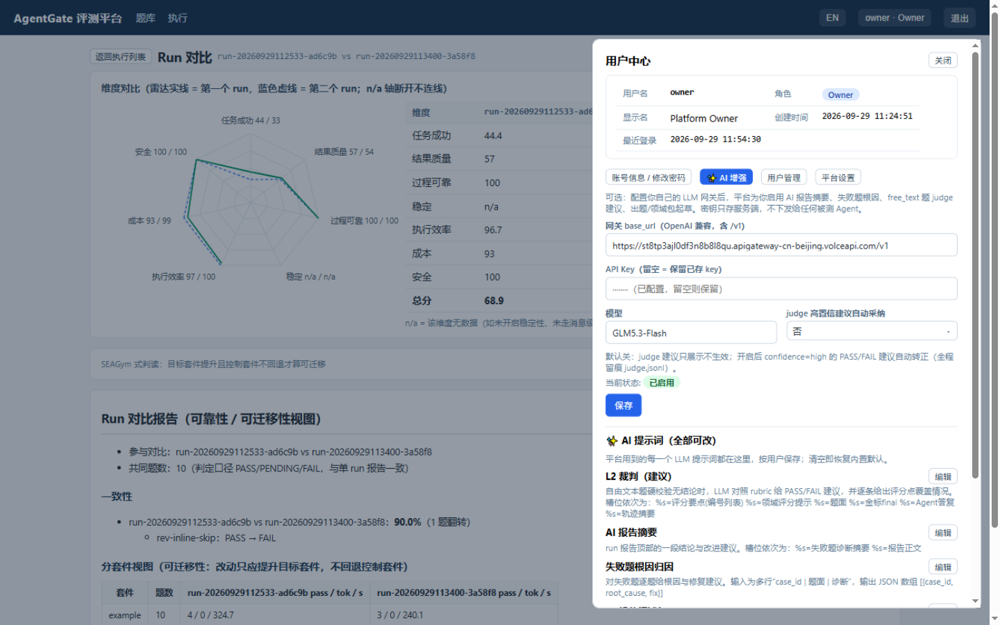

[English](../en/ai-assist.md) | 简体中文（本页）

# AI 辅助：平台自己的 LLM 用在哪、怎么配、边界在哪

本文档说明平台的可选 AI 增强功能：需要什么配置、每个功能增强什么、以及"AI 能做/不能做"的边界。

## 配置入口与凭据

**用户中心（右上角账号菜单）→ AI 增强**，按用户各自配置：

| 字段 | 说明 |
|---|---|
| 网关 base_url | OpenAI 兼容接口（含 `/v1`） |
| API Key | 只存服务端数据库，界面不回显，不下发给任何被测 Agent |
| 模型 | 如 GLM5.3-Flash |
| judge 高置信建议自动采纳 | 默认关（见下） |

三把凭据的关系（互不共用）：这里是**平台辅助功能的钱**；被测 Agent 的模型凭据是
**被测系统自己的钱**；录制代理上游是**转发目的地**。详见部署文档第 0 节。

## 四个增强点

| 功能 | 干什么 | 默认行为 |
|---|---|---|
| 报告 AI 摘要 | run 完成后在报告尾部追加：结论一句话 + 2-4 条改进动作（指明改提示词/工具/检索/流程哪层） | 配置了 AI 即启用 |
| 失败题根因 | 逐题给出 root_cause 与 fix 建议，附在报告 AI 节里 | 同上 |
| judge 建议 | free_text 等 PENDING 题由 AI 对照 rubric 打分，给出 PASS/FAIL/PARTIAL + 置信度 + 理由 | **只展示不生效**；开启"高置信自动采纳"后 confidence=high 的 PASS/FAIL 建议自动转正（judge.jsonl 全程留痕） |
| 出题/领域包起草 | 出题表单"✨ AI 起草 gold"：判定题型并从材料抽取候选答案与检查点；编辑页"✨ AI 起草领域包"：起草领域包 JSON | 草稿需人工逐项确认；保存领域包即签名 `llm-draft+human-reviewed` |
| 结果异议 AI 修订 gold | 逐题结果里 FAIL 题的"✨ AI 改 gold"：结合题面/现行 gold/Agent 实际答复/判定理由，起草修订后的 gold；AI 会先区分"Agent 答错（不改）"与"gold 不合理（给修订稿）" | 草稿可编辑，确认后经正常 PATCH 写回题库，写回后重跑该题生效 |
| 待判题 AI 判（单题/批量） | 已完成的 run 若没配过 AI，会积压 PENDING 题——「✨ AI 判」单题出建议，「✨ 批量 AI 判」一次消化全部待判题（含评分点覆盖 y/x）；建议仅供终裁参考，人工仍是唯一裁定 | 发起时的"✨ AI 辅助判题"勾选控制 run 执行中是否自动出建议/根因/摘要 |

## AI 提示词全部可见可改

平台用到的**每一个** LLM 提示词都在 用户中心 → AI 增强 → "AI 提示词（全部可改）"：
裁判、报告摘要、根因归因、领域包起草、gold 起草、gold 修订，共 6 个，每个都显示
用途说明与槽位含义（%s 占位）。按用户保存，清空即恢复内置默认；自定义模板写坏时
平台自动回落到内置默认（不会弄坏 run）。后续有特殊口径（如按行评分、强制引用），
直接改提示词即可，无需改代码。

## 边界（铁律）

- **AI 不发明金标**：出题起草只做"题型判定 + 从材料/数据集答案结构化"，参考答案的来源
  必须是材料或数据集原文，人工确认后才入库。
- **AI 不单独放行安全项**：安全维的 P0 信号（违禁工具/注入/泄露）由硬校验判定，AI 建议
  无法改写。
- **AI 不翻硬 FAIL 的数值题**：数字对错由容差比对决定，异议走人工。
- 没配 AI 时平台完全可用（判定、评分、报告全是确定性逻辑），AI 只是增强。
