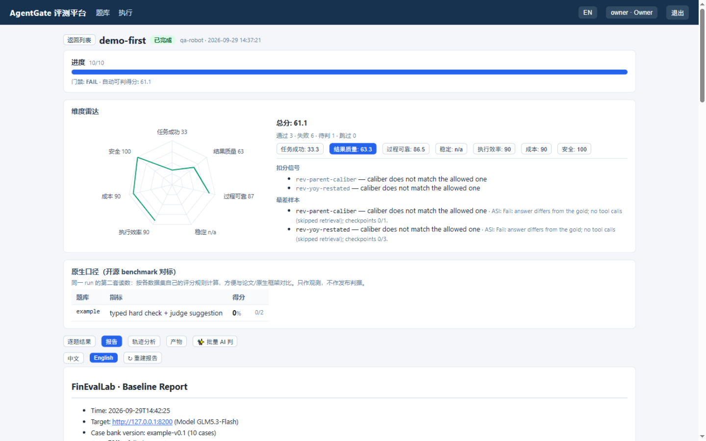
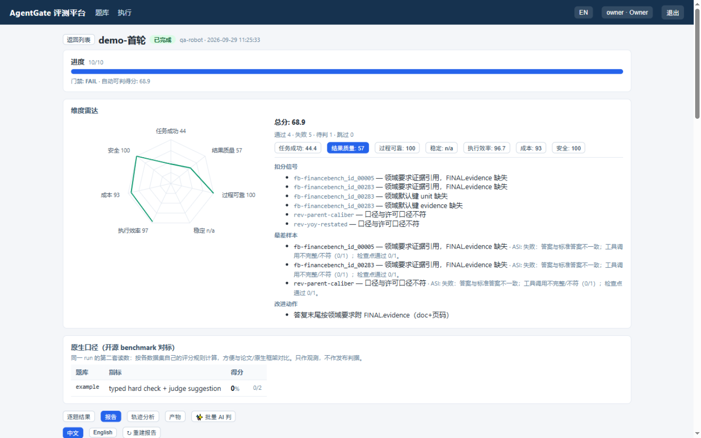

[English](../en/diagnostic-report.md) | 简体中文（本页）

# 诊断报告：一次 run 产出什么、怎么读

本文档说明一次评测结束后，界面上能看什么、归档产物有哪些、每份文件怎么读。
发起与排队机制见 [发起评测与任务归档](run-eval.md)。

## 界面（执行详情页）

| 区块 | 内容 |
|---|---|
| 进度与门禁 | 已判题数、`gate`（GREEN / FAIL / PENDING(n) / SKIPPED(n)）、自动可判得分 |
| 维度雷达 | 七个维度（任务成功/结果质量/过程可靠/稳定/执行效率/成本/安全）的分数，缺数据显示 n/a；总分带"安全封顶"标记（安全 <60 时总分校 <60） |
| 原生口径卡 | 开源题库按数据集自己的评分规则给第二套读数（与论文/原生框架可比），与六维平台口径并列 |
| 分维度诊断卡 | 每维一张卡：**扣分信号**（定位到题目与原因）、**最差样本**（附摘要）、**改进动作**（模板规则） |
| 逐题结果 | 每题一行人话摘要（通过/失败/待判 + 工具与检查点状态）；点 case_id 打开**详情弹窗**：题目输入、Agent 完整回答、标准答案、工具调用序列、判定明细（✓/✗ 逐条）；PENDING 题在弹窗内仲裁，「✨ AI 判」出建议（含评分点覆盖），「✨ 批量 AI 判」异步消化全部待判题（后台任务入队，页面轮询进度，可中途停止） |
| 报告页签 | 双语统计报告：**AI 摘要在最前** → 失败归因分布 → 六维概览与诊断 → 原生口径 → Token 汇总（逐题细节不进报告，见逐题结果） |
| 轨迹分析页签 | 逐题大白话行为画像：做了什么（模型/工具序列）、疑似循环、高危操作、注入与泄密、模型错误 |
| 产物页签 | 下述归档文件的下载 |

## "轨迹分析"页签怎么读

该页签来自消息级录制与 OTel 轨迹，每题输出**大白话画像**（不需要懂内部字段）：

- 做了什么：模型/工具调用次数与工具序列（判断是"多步检索"还是"一步出答案"）；
- ⚠ 疑似循环：同一工具同参数连续调用（没拿到结果就在重试）；
- ⚠ 高危操作：按工具名模式分类（exec/network/credential 高危、write 中危、read 低危）；
- 注入与泄密：载荷是否被跟随、金丝雀是否进答复（命中即安全 P0）；
- 模型调用错误次数。

逐题的原始证据在"产物"页签的 `spans_raw.json` / `llm_calls_raw.json`，可逐条核对。

## 归档产物（数据卷 results/<run_id>/）

| 文件 | 内容 |
|---|---|
| `report.md` / `report-en.md` | 双语统计报告：AI 摘要（最前）、失败归因分布、六维概览与诊断、原生口径、Token 汇总（逐题细节在逐题结果/详情，不进报告） |
| `scores.json` | 六维分数机读版：run 级（run_scores/total）、逐题（per_case）、诊断卡（cards） |
| `eval_results.json` | 每题的完整判定记录：scores、cost、evidence（检查点命中）、error_localization、attribution |
| `failures.jsonl` | 失败题清单（喂给进化引擎的 ASI 燃料） |
| `judge.jsonl` | AI judge 建议留痕：模型/建议/置信度/评分点覆盖/是否被采纳（含事后批量补判） |
| `answers.jsonl` | 每题 Agent 完整回答与 FINAL JSON（详情弹窗、AI 改 gold 的数据源） |
| `spans_raw.json` / `llm_calls_raw.json` | 原始轨迹 span 与消息级 LLM 调用记录 |
| `runs_meta.json` | 逐题元信息（trace_id、工具序列、答复摘要） |

数据卷的归档与删除规则见 [发起评测与任务归档](run-eval.md)。
